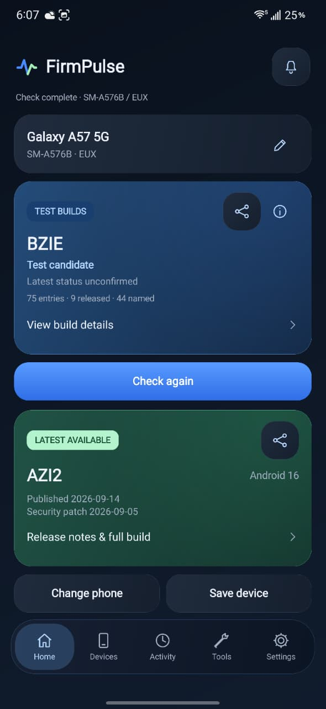

# FirmPulse

Samsung test and released firmware, in one place. Built by **Haroon** for Android 9 and newer.

[Download APK](https://github.com/haroon-ai1/FirmPulse/releases) · [Star the project](https://github.com/haroon-ai1/FirmPulse) · [Contribute](CONTRIBUTING.md)

## App UI preview

FirmPulse checking firmware on a Samsung Galaxy A-series phone.



## What you can do

- Check a Samsung model and region/carrier code (CSC), with editable fields and dropdown suggestions.
- Explore test and beta-style build entries. Hidden names are verified locally against complete build strings when possible.
- See released firmware, Android version, security patches and release notes when Samsung supplies them.
- Save devices, compare regions, export results and optionally watch for changes.
- Share a branded PNG from the test/beta or latest-available card, with complete build strings and supplied dates.
- Use a compact interface with a floating glass tab bar, blue test cards and green released cards.
- Follow your phone's theme by default, or choose Light or Dark. Glass effects and Reduce motion are configurable.

No account, advertising, analytics, home-screen widget or app-owned server is required.

## First launch

No example phone or firmware result is preloaded. On a Samsung device, the app prefills its model when Android provides a usable value. Enter the active CSC yourself; the app does not guess it from your country. On other devices, choose a Samsung model manually. Your last chosen model/CSC and explicit theme preference are retained.

## Current limitations

**S-series support is being improved.** Models beginning with `SM-S` display an in-app notice: test and beta results may not be fully accurate yet. Recovery of the newest hidden S-series test name is not guaranteed.

An older test or beta entry is labelled **Older build found** when published dates or comparable build-code clues support that conclusion. Build-code months are not release dates. Different same-month branches are not ordered speculatively. Missing or failed released data does not produce an invented age warning.

A test-list entry does not prove public beta enrollment, an available download or a rollout date. Empty latest fields and hidden names remain explicit. Known released builds do not become the test headline. First-observed dates belong to this installation rather than Samsung's worldwide history.

Glass blur is available on Android 12+; older versions use a tinted surface. Android controls the actual timing of background checks. Physical-phone frame-rate, battery and background-timing checks remain separate from automated layout validation. The interface is English-only.

## Build and test

Open this repository's root folder in Android Studio. Use JDK 17, Android SDK Platform 36 and Build Tools 36.0.0. The project uses Gradle 8.14, Android Gradle Plugin 8.13.0 and Kotlin 2.2.20.

```bash
bash scripts/test-core.sh
./gradlew :app:testDebugUnitTest :app:lintDebug :app:assembleDebug
```

Debug APK: `app/build/outputs/apk/debug/app-debug.apk`.

For an installable release, use **Build → Generate Signed App Bundle / APK → APK**, or provide the four signing environment variables described in [RELEASING.md](RELEASING.md) and run `./gradlew :app:assembleRelease`. Without signing configuration, the release output is unsigned.

The 1.0.0 APK is a non-debuggable release, signed with the owner's permanent release key. The source contains no signing key or password. Its application ID remains `io.github.haroonjadoon.firmscope`. Earlier development APKs use different certificates: export saved devices, uninstall the earlier development version, install 1.0.0 and import your saved devices.

A one-time optional GitHub star prompt appears five seconds after the first completed check with available data. It waits while the app is backgrounded or another dialog is open.

## Developer

**Haroon**

- [GitHub](https://github.com/haroon-ai1)
- [Portfolio](https://haroon-ai1.vercel.app/)
- [LinkedIn](https://pk.linkedin.com/in/haroon-ai)

If FirmPulse is useful, [give the repository a star](https://github.com/haroon-ai1/FirmPulse).

## Open source

FirmPulse's independently written app code is MIT licensed. Contributions are welcome through issues and pull requests; the maintainer reviews and merges them. See [CONTRIBUTING.md](CONTRIBUTING.md), [privacy](PRIVACY.md), [third-party notices](THIRD_PARTY_NOTICES.md), [protocol notes](docs/PROTOCOL.md) and [validation](docs/VALIDATION.md).

FirmPulse is independent of Samsung. Samsung's trademarks and metadata remain their owners' property. Images in `docs/ui-previews` are simulated regression renders using fixture data, not evidence of a live beta build.
